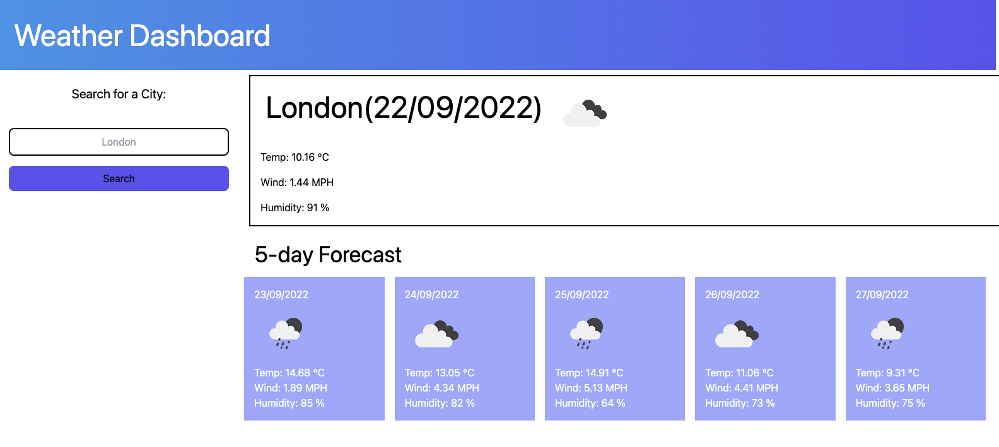

# Weather Dashboard

Deployment link: https://slingshort.github.io/weather-dash/

In this project, the aim was to design a weather dashboard to successfully fetch information from a weather API so that as a user, I can search a city and obtain easily viewable weather information for the next five days.

## Functionality

* Shows current selected city and current date in main container
* Shows weather forecast for the next 5 days after that
* Intuitive interface which is responsive across different device sizes

## Obstacles
The first major obstacle was trying to interpret the information fetched from the API and ensuring that I carefuly read the docs provided. It took a bit of time for me to realise that all the array results returned from the API fetchURL I used were forecast data for every 3 hours - hence there are 40 array items (the API returns results for 5 days, hence there are 8 results per day, hence there are 8 3 hour increments per 24h day). When fetching data, I had to be careful to include the correct array index to correspond to a particular date.

The second difficulty was trying to figure out what the icon ID meant and how to properly access this from the fetched data. It took a bit of reading into the docs to find the approprite URL in which the icon ID could be included as a query parameter to obtain the image. It also took me a while to display the image properly on the page.

## Fixes Needed
* Form submit event listeners need to be clicked/entered three times before function works

## Further Development needed
* Use more loops with sections of repetitive code to make project more scalable
* 